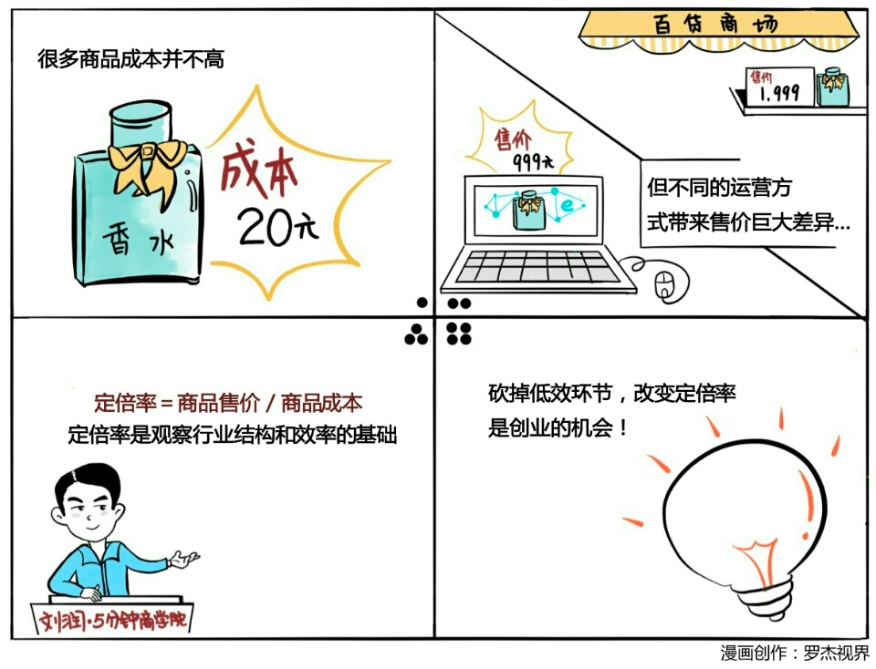

# 007｜哪有什么一分价钱一分货
刘润2016年10月4日

## 概念：定倍率

定倍率是商品的零售价格除以成本价的那个倍数。100块成本的东西，卖500块，定倍率就是5倍。鞋服行业：一般是5～10倍。化妆品行业：一般是20～50倍。

### 案例

>买国际品牌登山鞋，专卖店打折后2182元，京东价1188元，线上比线下便宜一半左右。因为线下的成本结构，导致5～10倍的定倍率是很合理的，而线上的成本结构，同样导致3倍是一个合理的定倍率。运营方式不同，带来运营效率不同，就产生了定倍率的巨大差异。

>某非常著名的化妆品品牌，有一款产品，建议零售价大概在1000块钱左右，它的成本价大概只有20多块钱人民币。（这些数字可以在网易的成本控栏目中查阅）

## 运用：场景

出版行业，是由作者、出版社、印刷厂和新华书店组成的。最核心的知识是作者创造出来的，可是作者只能拿到这本书价格的10%左右，也就是说，出版行业的定倍率大概是10倍。这合不合理呢？这非常合理，这是这个行业多年形成的分配规律。

新华书店，基本都是原价售卖。

当当网，因为没有巨大的线下运营成本，新书上架至少八折起，甚至有七折或者六折的价格。

Kindle电子阅读器，连纸张都不需要印刷了，电子书比打折的纸质书更便宜。

起点中文网，一群人写连载，一群人付费读，连出版都不需要。

同样的内容，科技的进步，举起了倍率之刀，不断地砍向定倍率，让消费者可以用更便宜的价格获得同样的价值。

## 小结：如何制定产品的定倍率？

我们应该把定倍率做的更高好呢？还是做的更低好呢？

这要看你手中的武器：

如果你手中的武器是创新，也就是说，你能做一个别人做不出来的东西，那么请大胆地提高定倍率。

如果你手上的武器是效率，你就有资格拿起倍率之刀，一刀一刀砍向在今天的科技之下、显得低效的环节，获得颠覆性的竞争优势。

定倍率是用来观察每个不同的行业的结构和效率的重要标准和基础逻辑，你学会了吗？
