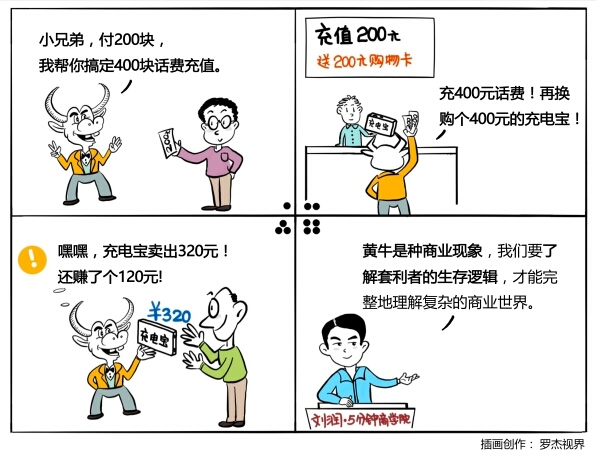

# 010｜黄牛，商业世界的黑客？
刘润2016年10月6日

## 概念：规则之缝（黄牛经济）

黄牛是一种不可忽视的商业现象，他之所以能存在，是因为无论我们怎么去精心设计，一切商业规则的背后，都是可能有其漏洞或者是缝隙的。黄牛或者说套利者，就是靠此缝隙获利的那个人群。大家千万不要觉得黄牛就是倒买倒卖而已，他甚至是一切复杂规则的探伤器，商业世界的黑客。

### 案例

>国庆期间，某通信运营商推出充200元话费返还200元购物券的活动，于是黄牛就利用规则的漏洞，来套取利润。

>具体操作是，给黄牛200块，他给你充400块话费，凡找到来充值的人，就给代理费20块。也就是你给黄牛200块，黄牛再掏200块，给你充值400块，然后黄牛再给代理20块，即黄牛总共掏出220块，但黄牛会得到一张400块的购物卡。

>黄牛拿着400块的购物卡，去买售价400块、但进货价至少要350块的充电宝，再以320块卖给一些商店。因为比进货价都便宜，很多商店都愿意购买。

>最终，黄牛付出了220块的现金，却很快得到了320块的回报，净赚了100块钱。不要小看这100块，他通过代理的方式放大了自己的套利能力，在节假日的几天之内，可能就会净赚几十万。

## 运用：场景

假设有3个外汇交易市场，美元兑日元，日元兑英镑，英镑兑美元，汇率始终是在快速波动的，这就有可能通过快速自动化的操作，来赚取中间的差价，可能100美元只有几分钱的利润，但规模很大的时候，收益也可能巨大无比。当然，我们谈的是一个理论上的可能性，因为这种套利可能性的存在，反而导致3个外汇交易市场之间的价格，始终是均衡的。

## 小结：凡有力的地方就一定有反作用力

凡有力的地方就一定有反作用力，凡有正向的商业价值就有反向的套利，我们只有理解了规则之缝的存在和套利者的生存逻辑，才能更完整的理解这个复杂的商业世界。
