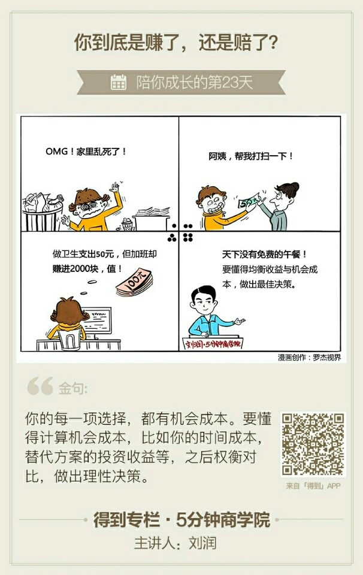

# 023｜你到底是赚了，还是赔了？
刘润2016年10月25日

## 概念：机会成本

机会成本是指你做了某项选择，而不得不因此失去的其他利益。比如，如果做出选择A，就必须放弃B的话，B就是A的机会成本。

对企业来说，最优方案的机会成本，就是次优方案可能带来的收益。

### 案例1

>我听到过最让人潸然泪下的创业故事是，10年前，一位创业者以80万元的总价卖掉自己深圳的房子去创业。几年白手起家的努力后，公司开始走上了正轨。辛苦打拼到去年，终于赚到了400多万元的利润。他非常高兴。最近他用这些钱做首付，把自己当初卖掉的那套房子又买回来了。

>很多人说，房地产已经成为中国经济的鸦片。为什么这么说？大家都能赚点钱，不是挺好的吗？要理解这句话，你首先要理解经济学中的一个重要概念：机会成本。

>为什么很多人说房地产是中国经济的鸦片？是因为如果在房市里赚钱太容易了，两年居然可以投资翻倍，那每年50%的投资收益率，就是所有其他行业的“机会成本”。相对于这个机会成本，中国绝大部分行业都在亏钱，稍微理性一点点的商人，都会关厂炒房。但如果整个中国经济都躺在床上吸食房地产，没有人办厂、创业，经济最终会崩溃。

>房地产有不少好处，但其很大的一个问题，就是提高了整个中国经济发展的“机会成本”。

### 案例2

>比如我把1万元存余额宝，一年收益大概是300元。如果你选择拿这钱去投资，就不得不失去把钱放在余额宝的一年300元的比较确定的收益。这300元，就是你去投资的“机会成本”。如果一年结束，你赚了200元，也许你觉得自己赚了，但相对于300元的机会成本，其实，你是亏的。如果今天国家发行了一个风险极小，年收益有6%的债券，也就是说，如果你用1万元买债券，能赚600元。那么，你的投资收益就算是500元一年，都是亏的。

你到底是赚还是赔，不能仅仅看账面收益，还要看机会成本。

## 运用：场景

- 场景1：

如果，你卖的是相对较贵的东西，你可以通过强调便宜的东西隐藏的“机会成本”，来获得客户。比如你卖昂贵的西装，你可以告诉客户，如果你贪图便宜，买过于便宜的西装，你可能是因为穿着不讲究，无法赢得客户尊重，而丧失生意的机会。丧失生意机会，是买过于便宜的西装的机会成本。

- 场景2：

对个人来说，时间，是最大的机会成本。建议你用自己的年收入，除以一年的工作时间，大约2000小时，看看自己一小时的“机会成本”是多少。比如，你年薪20万，那你一小时的机会成本就是100元。然后，你做每一件事情的时候，都问问自己，做一小时这件事情，值不值100元。如果不值，大方的花钱请别人来做。付费，就是赚钱。

- 场景3：

但是，对于“机会成本”的计算，也不能盲目放大。比如，有的女孩子觉得自己可以嫁给王思聪。当她把嫁给王思聪作为自己结婚的机会成本时，就可能会专业相亲30年，却无法把自己投资出去。

## 小结：如何善用机会成本？

什么是机会成本？如果做出选择A，就必须放弃B的话，B就是A的机会成本。对企业来说，最优方案的机会成本，就是次优方案可能带来的收益。

如何善用机会成本？

1. 你要知道你每一项选择，都有机会成本，天下没有免费的午餐。
2. 你要懂得计算机会成本，比如你的时间成本，替代方案的投资收益等，然后通过权衡收益和包括机会成本在内的各项成本，做出理性的决策。

