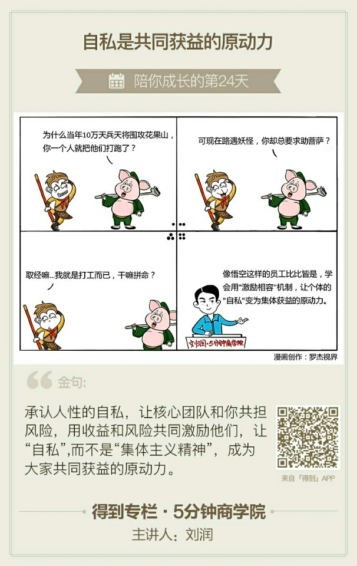

# 025｜企业的边界在哪里
刘润2016年10月27日

## 概念：交易成本

交易成本就是你从自由市场上寻找、沟通、购买一项服务，为这个购买能够达成，所付出的时间和货币成本。通常来说，交易成本包括搜寻成本、信息成本、议价成本、决策成本、监督交易进行的成本等等。

科斯的“交易成本”理论，回答了经济学家一直争论的一个问题：企业的边界在哪里？企业应该做大还是做小？

科斯说，是交易成本与管理成本的对比，确定了企业的边界。交易成本越低的事情，越应该外部化；管理成本越低的事情，越应该内部化。

### 案例1

>快到年底了，今年业绩很不错，又恰逢公司成立10周年，你想要办一个盛大的年会庆祝一下。行政部的负责人来找你，说：这么大的活动，人手不够啊。要不，行政部请人力资源部、财务部的所有同事，20多人一起来办这件事情。要不，找外面的专业团队来做，行政部几个人来协助吧。

>你会怎么选呢？让自己的员工来做，还是找外面的公司来做？判断的标准是什么呢？

>判断的标准：如果投入20人来办一场晚会的管理成本，高于请会务公司的交易成本，那就应该请会务公司来做。

### 案例2

>为什么亚马逊用FedEx作为物流支撑，而京东要花巨大成本构建自己的物流体系？

>因为美国的物流体系已经非常发达，可靠度也非常高，亚马逊可以很放心地用相对低的价格，购买到高品质的物流服务。因为成熟，交易成本，比如搜寻成本、决策成本等，都很低。自己做呢？第一，不一定做得比FedEx好，第二，自己组织团队来做的管理成本，可能比从外部购买的交易成本更高。所以，亚马逊用公共物流体系，而不是自建。

>而京东对物流的速度、品质要求非常高。它想在中国市场上搜寻到符合条件的公众物流公司，非常难。议价成本、决策成本，尤其是监督交易进行的成本，都会非常高。虽然管理很麻烦，但是自己组织团队来做的管理成本，还是比从外部购买的交易成本更便宜，所以京东选择自己来做。

## 运用：场景

- 场景1：雇佣设计师 VS 外部设计师

过去，因为偶发的小设计需求，找设计公司，人家不搭理你。而市场上也找不到合适的设计师，所以很多企业需要雇一个设计师。

后来，有一家叫“猪八戒”的网站，用非常高效的手段，把即便是藏在六线城市的设计师都连接了起来。让偶发小设计需求，找到接散活还很便宜的设计师的“交易成本”，大大下降。雇佣一个设计师，就立刻显得低效了。于是，设计师的外部化，就成为了趋势。

- 场景2：IT部门 VS 云服务

过去，很多企业在自己办公室都有几台服务器，放邮件系统，办公系统，甚至业务系统。除了出钱请人开发，还要雇一两个技术人员，管理这些系统。

后来，云计算出现了，公有云，基于互联网的邮件系统、办公系统，又便宜又方便。购买这些服务的交易成本，比维护自有系统的管理成本，少得多。于是，云计算，就成了趋势。

## 小结：企业的边界在哪里？

1. 科斯认为，“交易成本”和“管理成本”的对比，决定了企业的边界。
2. 根据科斯的逻辑，和我们对交易成本会不断降低的趋势的判断，可以得出推论：总体来说，未来企业规模会越来越小。也就是互联网人士说的，未来会是“自由人的自由联合体”。这是个理想的极致情况，但趋势是对的。
3. 在今天，你必须找到那些你自己做，比市场更高效的事情，建构你的核心竞争力，而把那些你做得其实一般的事情，尽快扔回给市场。

