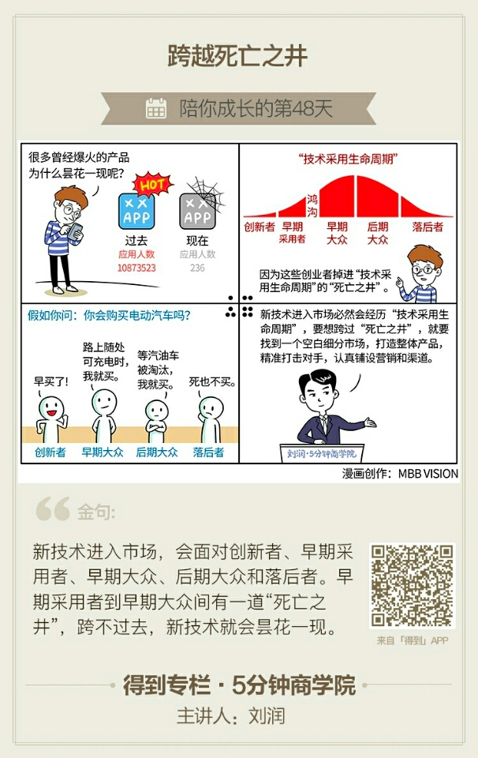

# 048｜跨越死亡之井
刘润2016年11月29日

## 概念：技术采用生命周期

“技术采用生命周期”，是新技术推向市场时，必然会面临的五个阶段，每个阶段，面对截然不同的消费者。

- **第一阶段，面对的是创新者。**创新者天生对新科技充满了好奇。他们一直在搜寻。所以，并不是你找到了他们，而是他们找到了你。他们甚至愿意参与创造。这群人，大概占所有用户的2.5%。

- **第二阶段，面对的是早期采用者。**你身边总有一两个特别懂电子产品的，特别懂车的，分得清楚每一款空气净化器优劣的。他们是意见领袖。他们享受新科技的优点时，也包容新科技的瑕疵。这群人占整个市场的13.5%。
  获得这群人的认可，千万不要沾沾自喜。因为，他们，并不真的代表大众。
- **第三阶段，才会面对真正的大众，摩尔称之为：早期大众**。他们只关心需求，根本不关心技术。所以，相对于现有产品，你的技术必须有明显优势，并被反复验证稳定可靠，他们才会购买。这群人占整个市场的34%。
  早期采用者，和早期大众之间，有一个死亡之井。没能纵身一跃，把意见领袖喜欢的“有趣的科技”，变成普罗大众喜欢的“有用的产品”，是现象级产品昙花一现的真正原因。
- **第四阶段，面对的是后期大众**。他们更保守，对风险更敏感。身边很多朋友做激光近视手术三五年了，他们还是会说：20年后再看吧。这群人，也占整个市场的34%。
- **第五阶段，面对的是落后者**。他们对所有新技术充满了敌视。你试图说服他们使用移动支付，却发现，他们居然还只用现金，连可以绑定移动支付的银行卡都没有。这群人，占整个市场的16%。

杰弗里·摩尔在1991年提出的“技术采用生命周期”理论，今天依然完美解释着各种新技术进入市场时的处境。

### 案例

>你还记得那些曾经被热捧的科技产品吗？比如，把激光投射在桌面上，酷到没朋友的投影键盘？比如，一夜之间就火遍微信朋友圈，一夜之间就又销声匿迹，仿佛什么都没有发生过的脸萌？很多“现象级”产品，都在它最美丽的瞬间消失，昙花一现。

>为什么会这样？夏天的火爆之后，难道不应该是秋天的收获吗？到底是什么原因，导致了他们快速成功，又瞬间失败呢？

>杰弗里·摩尔说，那是因为，这些勇敢的创业者，在技术创新的道路上一路狂奔时，掉进了“技术采用生命周期”的“死亡之井”。

## 运用：如何运用这个理论呢？

**第一，你要懂得分辨用户处于哪个阶段。怎么分辨？问个很简单的问题：你会购买电动汽车吗？**

- 如果他说：早买了，我在家和公司都装了充电桩，那他多半是个创新者，或者早期采用者。
- 如果他说：等路上随处可充电时，我就买。他是个早期大众。
- 如果他说：等汽油车被淘汰，加油不方便时，我就买。他是个后期大众。
- 如果他说：这种反人类的东西，死也不买。不用问，这是个落后者。

**第二，我应该怎样跨过死亡之井，把有趣的技术，变成有用的产品呢？摩尔说，你可以试试：诺曼底登陆法。**

- 首先，找到一个空白细分市场，就像诺曼底海滩一样，准备登陆。在著名美剧《硅谷》里，创业者有一项巨牛的文件压缩技术，可用来做音乐分享，也可用来做企业存储。这项技术红透了整个硅谷，然而依然不成功，直到他们找到了自己的诺曼底海滩，把这项技术用于视频直播的时候，他们成功登陆了“早期大众”这个战场。
- 然后，要打造整体产品，集团作战。早期大众对科技无感，他们痛恨死机重启。所以你要懂得，除了提供解决核心问题的功能外，提供整体的产品体验，优秀的售后服务，充沛的配件，无微不至的培训，完善的用户社群等等。坦克兵、步兵、医务兵、粮草，要整装待发，而不是游击队。
- 再然后，找到你的精准打击战术。你在主流市场中要替代的竞争对手是谁？你的产品的定位，有没有直击他没有满足的用户痛点，选好自己主攻武器，和打击策略。
- 最后，登陆诺曼底之后，认真铺设营销和渠道，做好打一场又一场艰苦巷战的准备。

## 小结：什么是死亡之井？

一项新技术进入市场时，会按顺序面对创新者、早期采用者、早期大众、后期大众和落后者。包容的早期采用者，到挑剔的早期大众之间，有一道“死亡之井”，跨不过去，新技术就会昙花一现。想要跨过去，可以学习诺曼底登陆。一，找到无人海滩；二，构建整体战队；三，运用致命武器；四，开打艰苦巷战。

