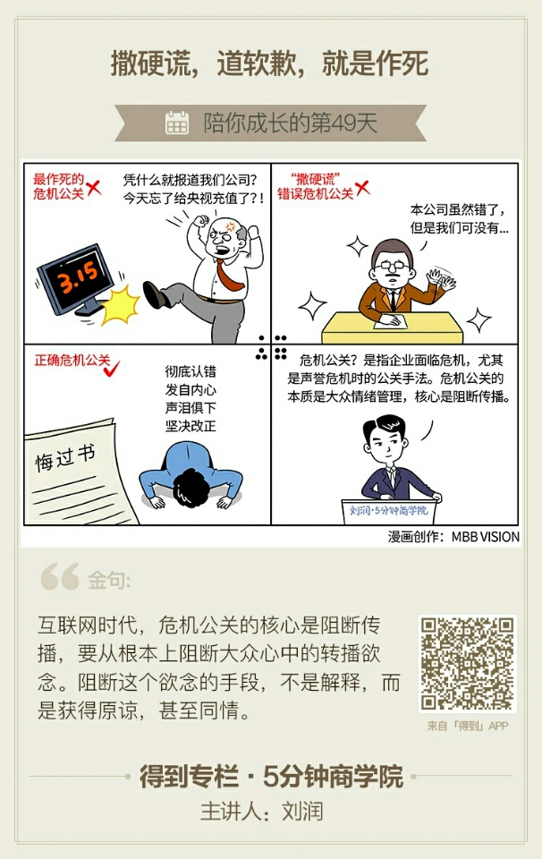

# 049｜撒硬谎，道软歉，就是作死
刘润2016年11月30日

## 概念：危机公关

危机公关，是营销中的一个特殊职能，是指企业面临危机，尤其是声誉危机时的公关手法。它的本质，是大众情绪管理。

互联网时代的危机公关的核心，是阻断传播。而互联网时代的传播，不是来自媒体，而是来自大众自身。所以，阻断大众心中的转播欲念，是根本。阻断这个欲念的手段，不是解释，而是获得原谅，甚至同情。

### 案例

>每年的3·15晚会，多少企业家坐立不安。在商品质量普遍低下、服务普遍较差的背景下，其实央视的工作并不难做。闭着眼睛点名，随机跟踪调查，找不出一点问题，是很难的。所以，这场晚会本质上抽查的不是各公司的产品和服务，而是抽查各公司的危机公关水平。

>很多公司被点名后的第一反应，是五雷轰顶，稍微冷静之后，是极其愤怒：我这么努力为消费者提供最好的服务，但是你看看那谁谁，那谁谁谁，做得差多了，为什么不曝光他们？就因为我们投的广告不如他们多，就这样整我们？

>然后就会“脑子被枪打过了”似的，冲动之下，发出“对不起，今天忘了给央视充值了”之类的作死言论。

>别人没问题吗？也有。那为什么我这么倒霉？没有为什么，就轮上你倒霉了。这个倒霉，要认。为什么，你再看一遍视频，你一点问题没有吗？只要有问题，哪怕是小问题，万众瞩目之下，都是大问题。大众的负面情绪已经被激活了。

## 运用：那应该怎么办呢？

危机公关的第一步，就是要认倒霉。那种“别人还不如我呢”的失衡心态，会扭曲之后的正式回应。

移动互联网时代，媒体，即便是央视的3·15晚会，都只是这个危机的导火索。公关部门需要清晰地认识到，真正的危机，开始于不受任何媒体控制的、在互联网里如洪流一样急速传播的情绪。媒体只管杀人，不管刨坑。一旦点名了，忘了中央电视台吧。真正的危机还没开始。是你下面的回应，决定了这个危机是否开始，如何开始。

不能撒硬谎，还是认错吧。

在一亿双眼睛下，用“撒硬谎”这样的手段危机公关，都是作死。你的公关总监一定是竞争对手派来的。

认错回应的每个字都非常重要，尤其是字里行间传递的情绪。危机公关，本质就是大众情绪管理。你没有办法通过影响中心化媒体的手段影响大众情绪，就只能通过这短短的一段文字来影响了。

如果你在第一步“认倒霉”这个步骤，认得还不彻底，你就会把情绪带到文字中，你自己觉得有理有据有节，进退分寸拿捏得当的一篇声明，因为那种不服气的情绪，在大众眼中，很可能就是一篇防卫性极强的申辩书。这种“道软歉”，会招来一片谩骂，引发真正的危机。这是往刚刚燃起的火星上，用高压油枪浇油。

应该怎么认错呢？先认倒霉，再认错。发自内心、声泪俱下地，往死里认错。不要申辩，不要申辩，不要申辩。每一句申辩，都是往火上浇的一桶油。找到被曝光的这个问题的根源，提出一针见血的解决方案，然后自扇耳光，打到消费者看傻了，于心不忍为止。让刚刚冒头的火苗，熄灭在开始的地方。

## 小结：什么是危机公关？

危机公关是指企业面临危机，尤其是声誉危机时的公关手法。危机公关的本质，是大众情绪管理。移动互联网时代，大众情绪如洪荒之力，只有情绪能够引导情绪。

如何回应央视3·15点名：

1. 要自认倒霉，那种“谁谁更差你们不管”的失衡心态，会扭曲后面的回应；
2. 别玩手段，错把勉强道歉当成捍卫尊严的开场白；
3. 照死认错，万众瞩目之下小错也是大错，道歉到消费者于心不忍为尺度。

一切心存侥幸，试图移花接木把不满情绪引向央视的，都是作死。那些撒硬谎、道软歉的公关总监，还是立刻派去竞争对手那里吧。

